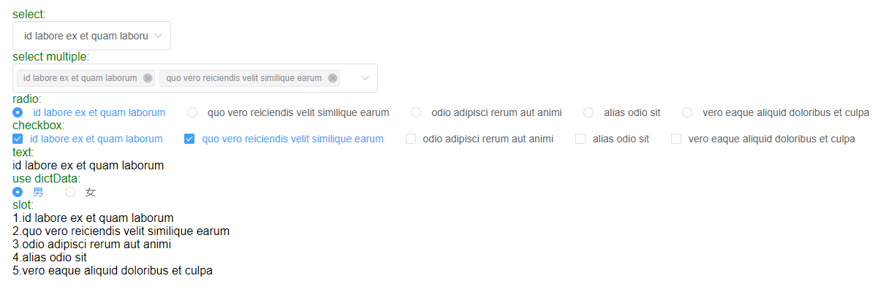

# vue-dictionary

## 安装

### npm 安装

```sh
npm i vue-dictionary
或
yarn add vue-dictionary
```

### cdn 使用

```html
<script src="https://unpkg.com/vue-dictionary/lib/vue-dictionary.umd.min.js"></script>
```

## 快速上手

- 可以在全局引入时传入字典配置，也可以在使用组件时传入单独的字典配置

### 全局引入

```js
import Vue from "vue";
import App from "./App.vue";
import axios from "axios";
import ElementUI from "element-ui";
import "element-ui/lib/theme-chalk/index.css";
import VDict from "../packages/index.js";

Vue.config.productionTip = false;

const getDict = type => {
  return axios.get("http://jsonplaceholder.typicode.com/posts/" + type + "/comments");
};

Vue.use(ElementUI);
Vue.use(VDict, {
  request: getDict,
  dataPath: "res.data",
  label: "name",
  value: "id"
});

new Vue({
  render: h => h(App)
}).$mount("#app");
```

## 示例



<details>

  <summary>点击查看代码</summary>

```html
<template>
  <div id="app">
    <div>
      <div class="label">select:</div>
      <v-dict v-model="dictValue" type="select" code="1"></v-dict>
    </div>
    <div>
      <div class="label">select multiple:</div>
      <v-dict v-model="dictArr" type="select" code="1" multiple style="width:500px"></v-dict>
    </div>
    <div>
      <div class="label">radio:</div>
      <v-dict v-model="dictValue" type="radio" code="1"></v-dict>
    </div>
    <div>
      <div class="label">checkbox:</div>
      <v-dict v-model="dictArr" code="1" type="checkbox"></v-dict>
    </div>
    <div>
      <div class="label">text:</div>
      <v-dict v-model="dictValue" code="1" type="text"></v-dict>
    </div>
    <div>
      <div class="label">use dictData:</div>
      <v-dict
        v-model="customValue"
        type="radio"
        :dictData="dictData"
        :dictOption="{ label: 'label', value: 'value' }"
      ></v-dict>
    </div>
    <div>
      <div class="label">slot:</div>
      <v-dict code="1">
        <template #default="{options}">
          <div>
            <div v-for="item in options" :key="item.value">{{ item.value }}.{{ item.label }}</div>
          </div>
        </template>
      </v-dict>
    </div>
  </div>
</template>

<script>
  export default {
    name: "App",
    data() {
      return {
        dictValue: 1,
        dictArr: [1, 2],
        customValue: 1,
        dictData: [
          {
            label: "男",
            value: 1
          },
          {
            label: "女",
            value: 0
          }
        ]
      };
    }
  };
</script>
```

</details>

## Props

- 除了 element 的 select/cascader/radio/checkbox 组件的所有属性外，还增加了以下属性
- el-cascader 中，props 的 emitPath 已被强制设置成 false

| 参数       | 说明                                                                                           | 类型   | 可选值     | 默认值 |
| ---------- | ---------------------------------------------------------------------------------------------- | ------ | ---------- | ------ |
| dictOption | 字典的配置，见下方说明                                                                         | Object | -          | -      |
| dictData   | 自定义的字典数据，当传入时，将不发请求                                                         | Array  | -          | -      |
| code       | 发送请求的字典代码                                                                             | String | -          | -      |
| type       | select 下拉选择,cascader 级联,radio(-button) 单选框,checkbox(-button) 多选框,text 文字         | String | -          | select |
| transform  | 多选时是否进行数据值的转换，只有 multiple=true 时生效，使用 join 和 split 的符号进行拼接和分割 | Bolean | true/false | false  |
| join       | transform=true 时对数组拼接成字符串的符号。type="text"时,数组拼接成字符串的符号                | String | -          | ","    |
| split      | transform=true 时对字符串分割成数组的符号                                                      | String | -          | ","    |

## Events

| 事件名称 | 说明             | 回调参数 |
| -------- | ---------------- | -------- |
| change   | 选择字典项时触发 | value    |

## Slots

| name    | 说明                                                                                                        |
| ------- | ----------------------------------------------------------------------------------------------------------- |
| default | 使用默认插槽时将不再根据 type 渲染组件，插槽暴露 options 属性：`<template #default="{options}"></template>` |

## DictOption

| 参数     | 说明               | 类型    | 可选值 | 默认值   |
| -------- | ------------------ | ------- | ------ | -------- |
| label    | 字典的名称属性值   | String  | -      | label    |
| value    | 字典的值属性值     | String  | -      | value    |
| children | 字典的子属性值     | String  | -      | children |
| request  | 字典的请求函数     | Promise | -      | null     |
| dataPath | 请求返回的数据格式 | String  | -      | res.data |
